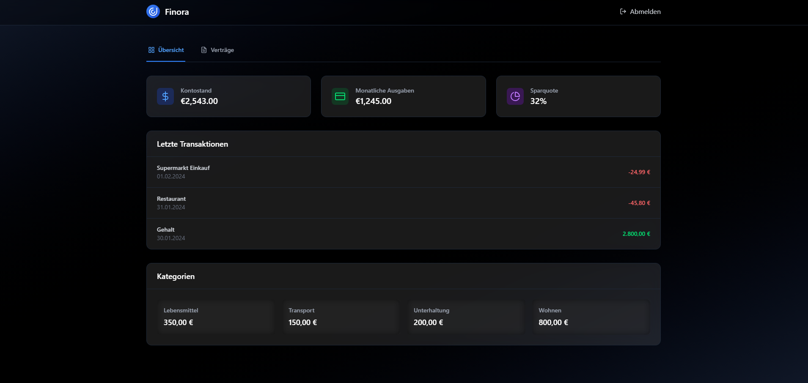
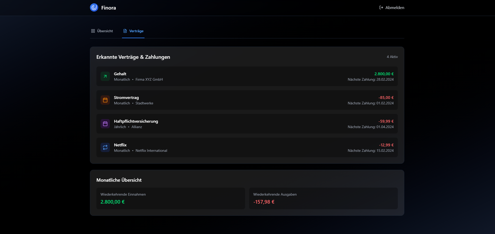
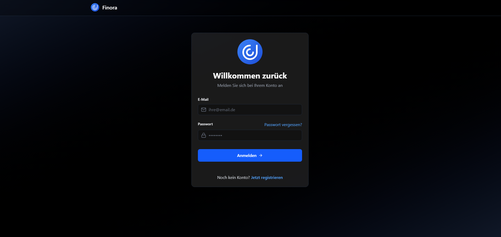
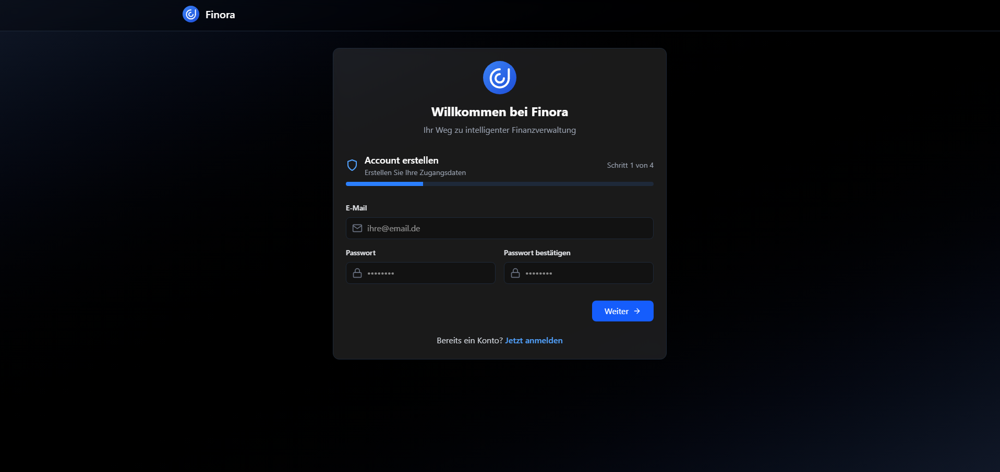

#  Finora - Intelligente Finanzverwaltung

Finora ist eine moderne Webanwendung zur intelligenten Verwaltung persönlicher Finanzen. Mit einer eleganten Benutzeroberfläche und fortschrittlichen Funktionen hilft Finora dabei, den Überblick über Ihre Finanzen zu behalten.

> [!IMPORTANT] > **⚠️ Work in Progress**
>
> Dieses Projekt befindet sich derzeit in aktiver Entwicklung. Bitte beachten Sie:
>
> -   Das Design und die Benutzeroberfläche können sich grundlegend ändern
> -   Die Projektstruktur und Architektur werden kontinuierlich optimiert
> -   Features können hinzugefügt, entfernt oder stark modifiziert werden
> -   Die Dokumentation wird laufend aktualisiert

## 🌟 Features

-   **Übersichtliches Dashboard**
    

    -   Echtzeit-Überblick über Kontostand
    -   Visualisierung der monatlichen Ausgaben
    -   Tracking der Sparquote

-   **Intelligente Transaktionsverwaltung**
    

    -   Kategorisierung von Einnahmen und Ausgaben
    -   Detaillierte Transaktionshistorie
    -   Filtermöglichkeiten und Suchfunktion
    -   Übersicht aller laufenden Verträge
    -   Automatische Benachrichtigungen bei Fälligkeiten
    -   Kategorisierung nach Vertragstypen

## 🚀 Technologie-Stack

### Frontend (finora-app)

-   React 18 mit TypeScript
-   Vite als Build-Tool
-   TailwindCSS für das Styling
-   Framer Motion für Animationen
-   React Query für State Management

### Backend (finora-server)

-   Node.js mit Express
-   PostgreSQL Datenbank
-   JWT für Authentifizierung
-   Winston für Logging

## 💻 Installation

### Voraussetzungen

-   Node.js (v18 oder höher)
-   PostgreSQL (v13 oder höher)
-   npm oder yarn

### Frontend Setup

```bash
cd finora-app
npm install
npm run dev
```

### Backend Setup

```bash
cd finora-server
npm install
# Erstelle .env Datei basierend auf .env.example
npm run db:init  # Initialisiert die Datenbank
npm run dev
```

## 🔧 Konfiguration

### Frontend (.env)

```
VITE_API_URL=http://localhost:3000
```

### Backend (.env)

```
PORT=3000
DB_HOST=localhost
DB_PORT=5432
DB_NAME=finora
DB_USER=your_user
DB_PASSWORD=your_password
JWT_SECRET=your_secret
```

## 📱 Screenshots

### Login-Bereich



### Registrierung



## 📄 Lizenz

Dieses Projekt ist unter der ISC-Lizenz lizenziert - siehe die [LICENSE](LICENSE) Datei für Details.

## 📞 Support

Bei Fragen oder Problemen erstellen Sie bitte ein [GitHub Issue](https://github.com/lulkebit/finora/issues).

---
